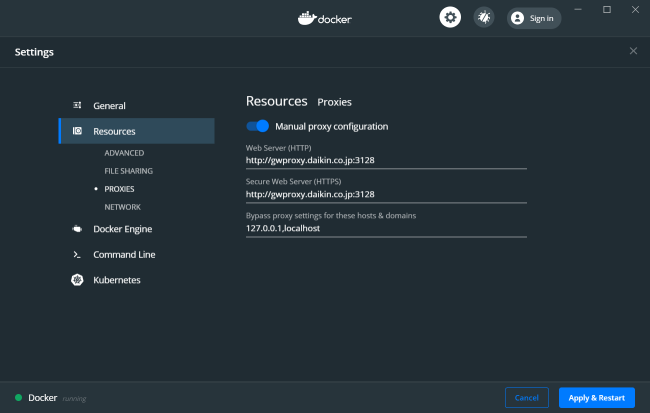
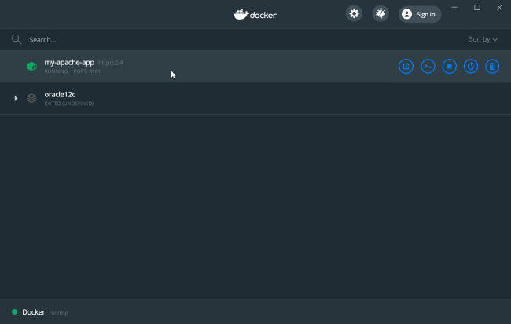
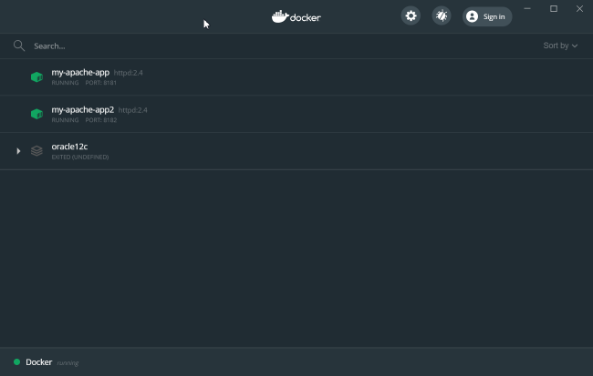
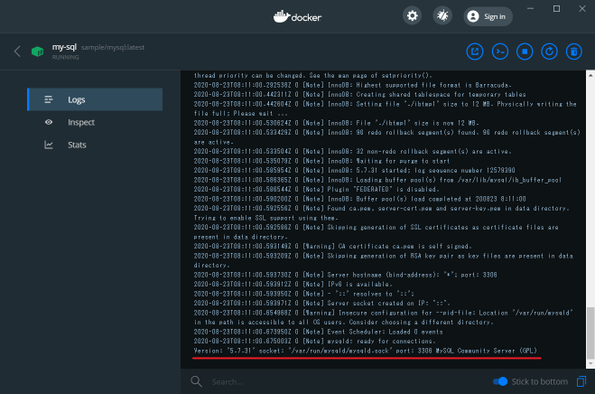
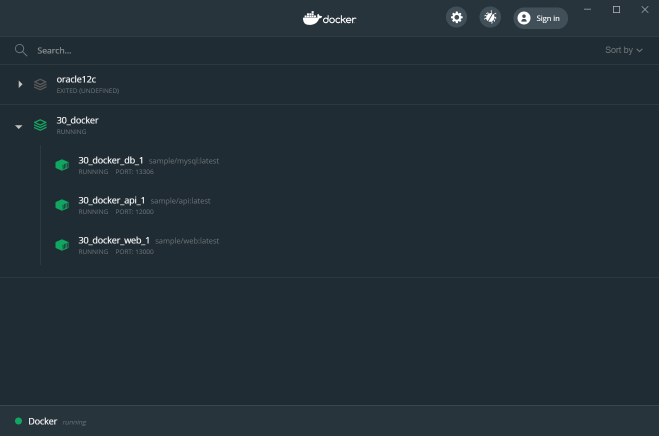
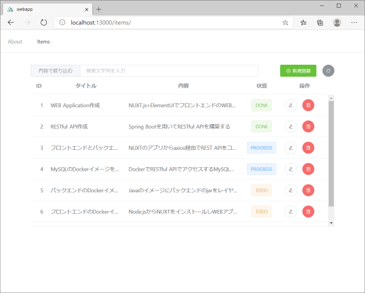
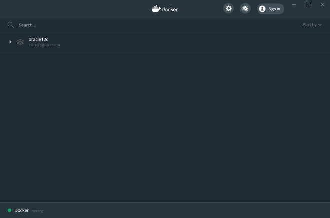
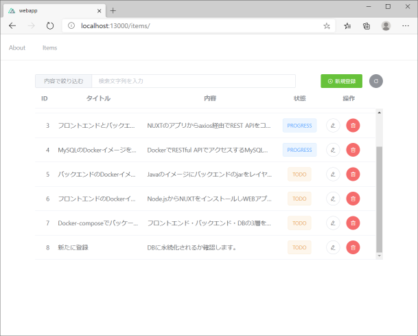

# DOCKER体験

- [DOCKER体験](#docker体験)
- [Dockerコンテナを動かしてみよう(1回目)](#dockerコンテナを動かしてみよう1回目)
  - [DockerDesktopを起動します](#dockerdesktopを起動します)
  - [Dockerコンテナを起動してみます](#dockerコンテナを起動してみます)
    - [表示を書き換えます](#表示を書き換えます)
    - [コンテナを停止します](#コンテナを停止します)
    - [コンテナの確認](#コンテナの確認)
    - [コンテナの削除](#コンテナの削除)
  - [イメージの操作](#イメージの操作)
    - [httpdイメージの確認](#httpdイメージの確認)
    - [イメージの削除](#イメージの削除)
- [Dockerカスタマイズイメージの作成(1回目)](#dockerカスタマイズイメージの作成1回目)
  - [httpdディレクトリへ移動](#httpdディレクトリへ移動)
  - [Dockerfile確認](#dockerfile確認)
  - [public-html/index.html確認](#public-htmlindexhtml確認)
  - [イメージファイルのビルド](#イメージファイルのビルド)
  - [作成イメージからコンテナ起動](#作成イメージからコンテナ起動)
- [MySQLのDockerイメージを作る(2回目)](#mysqlのdockerイメージを作る2回目)
  - [Dockerfile確認](#dockerfile確認-1)
  - [イメージのビルド](#イメージのビルド)
  - [コンテナの起動](#コンテナの起動)
  - [初期設定確認](#初期設定確認)
- [バックエンドのDockerイメージを作る(2回目)](#バックエンドのdockerイメージを作る2回目)
  - [Dockerfile確認](#dockerfile確認-2)
  - [イメージのビルド](#イメージのビルド-1)
  - [コンテナの起動](#コンテナの起動-1)
  - [動作確認](#動作確認)
- [フロントエンドのDockerイメージを作る(2回目)](#フロントエンドのdockerイメージを作る2回目)
  - [Dockefile確認](#dockefile確認)
  - [イメージのビルド](#イメージのビルド-2)
  - [コンテナの起動](#コンテナの起動-2)
  - [動作確認](#動作確認-1)
  - [コンテナの終了](#コンテナの終了)
- [マルチコンテナの実行(2回目)](#マルチコンテナの実行2回目)
  - [docker-compose.yml内容確認](#docker-composeyml内容確認)
  - [マルチコンテナ起動](#マルチコンテナ起動)
  - [DB初期設定](#db初期設定)
  - [各コンテナの動作確認](#各コンテナの動作確認)
    - [DBコンテナ動作確認](#dbコンテナ動作確認)
    - [RESTAPIコンテナ動作確認](#restapiコンテナ動作確認)
    - [WEBアプリ動作確認](#webアプリ動作確認)
  - [マルチコンテナのビルド(2回目)](#マルチコンテナのビルド2回目)
    - [一旦コンテナを止めて削除します](#一旦コンテナを止めて削除します)
    - [コンテナイメージをビルドします](#コンテナイメージをビルドします)

---

# Dockerコンテナを動かしてみよう(1回目)
既存のDockerイメージを取得しコンテナを起動します。

## DockerDesktopを起動します
DockerDesktopアプリを管理者モードで起動する

DockerDesctopで、proxy設定などを確認する



## Dockerコンテナを起動してみます
下記コマンドを入力し、apacheのWEBサービスを起動してみます。
```cmd
> docker run -dit --name my-apache-app -p 8181:80 httpd:2.4
Unable to find image 'httpd:2.4' locally
2.4: Pulling from library/httpd
bf5952930446: Pull complete
3d3fecf6569b: Pull complete
b5fc3125d912: Pull complete
679d69c01e90: Pull complete
76291586768e: Pull complete
Digest: sha256:3cbdff4bc16681541885ccf1524a532afa28d2a6578ab7c2d5154a7abc182379
Status: Downloaded newer image for httpd:2.4
6fca510eab6511414e336c88e002a8f1e6c5b185c2885f6b9b4d3c443b1903f4
```

http://localhost:8181　にアクセスしてみてください。

> <h1>It works!</h1>

と表示されたでしょうか？

localにhttpd:2.4のイメージがないので、DockerHubからイメージを取得し、そのイメージからコンテナを起動している状態となります。



### 表示を書き換えます
では、次に稼働しているコンテナに入って、表示を書き換えてみます。

```cmd
> docker exec -it my-apache-app /bin/bash
```
```sh
(カレントディレクトリを確認します)
root@9b7e127f9c95:/usr/local/apache2# pwd
/usr/local/apache2

(/usr/local/apache2/htdocsに移動します)
root@9b7e127f9c95:/usr/local/apache2# cd htdocs

(ファイルリストを確認します)
root@9b7e127f9c95:/usr/local/apache2/htdocs# ls -l
total 4
-rw-r--r-- 1 root src 45 Jun 11  2007 index.html

(index.htmlの内容を確認します)
root@9b7e127f9c95:/usr/local/apache2/htdocs# cat index.html
<html><body><h1>It works!</h1></body></html>

(ItをMy Httpdに書き換えます)
root@9b7e127f9c95:/usr/local/apache2/htdocs# cp index.html tmp;sed 's/It/My Httpd/' tmp > index.html;rm tmp

(index.htmlの内容を再度確認します)
root@9b7e127f9c95:/usr/local/apache2/htdocs# cat index.html
<html><body><h1>My Httpd works!</h1></body></html>

(コンテナから抜けます)
root@9b7e127f9c95:/usr/local/apache2/htdocs# exit
```
http://localhost:8181　にアクセスしてみてください。

> <h1>My Httpd works!</h1>

と表示されたでしょうか？


次に新しくコンテナを起動してみます。

```cmd
> docker run -dit --name my-apache-app2 -p 8182:80 httpd:2.4
```
http://localhost:8182　にアクセスしてみてください。

> <h1>It works!</h1>

と表示されたでしょうか？

**My Httpd works!** ではありませんでした。<br/>
これは、**『コンテナがイメージから新しく生成される』** ためです。


先ほど表示する文字を変更した時は、**『コンテナ』の中**に入って変更しました。これは、そのコンテナにしか有効ではありません。<br/>
また、AWSやAzureなどのマネージドされたコンテナ環境ではコンテナは停止と同時に破棄されるのが普通なので、必要な設定はイメージ側に持たせます。

httpd:2.4 というDocker公式イメージから、my-apache-app というコンテナと、my-apache-app2 というコンテナが生成され、それぞれ独立して動くようになります。


### コンテナを停止します
GUIから停止しする場合は「■」stopマークをクリックします。<br/>
コマンドラインから停止する場合は以下のように入力します。
```cmd
> docker stop my-apache-app2 my-apache-app
```

### コンテナの確認
どのようなコンテナが存在するか確認します
```cmd
> docker container ls -a
CONTAINER ID        IMAGE                                             COMMAND                  CREATED             STATUS                          PORTS               NAMES
166a8438a1e0        httpd:2.4                                         "httpd-foreground"       34 minutes ago      Exited (0) 30 minutes ago                           my-apache-app2
4118d90bb5d0        httpd:2.4                                         "httpd-foreground"       43 minutes ago      Exited (0) About a minute ago                       my-apache-app
```

### コンテナの削除
GUIから停止しする場合はゴミ箱アイコンをクリックします。<br/>
コマンドラインから停止する場合は以下のように入力します。
```cmd
> docker container rm my-apache-app my-apache-app2
my-apache-app
my-apache-app2
```

## イメージの操作
### httpdイメージの確認
```cmd
> docker image ls httpd
REPOSITORY          TAG                 IMAGE ID            CREATED             SIZE
httpd               2.4                 a6ea92c35c43        2 days ago          166MB
```

### イメージの削除
```cmd
> docker image rm httpd:2.4
Untagged: httpd:2.4
Untagged: httpd@sha256:3cbdff4bc16681541885ccf1524a532afa28d2a6578ab7c2d5154a7abc182379
Deleted: sha256:a6ea92c35c43206ac8a508b2be7d6d6b5ecf5f40e7a9042a35669bcbcb2da201
Deleted: sha256:074e0e3314f787dd955937eb5b17694b1f7fc64631f404223a62e2a4a1292fb6
Deleted: sha256:b05020dd1c0b21291751d69304826e21518a0fa056229bb5c5646a2f80aa2ce5
Deleted: sha256:0724735f53919994876490bd1e9633792f9533a646f2f5cd6a2c607e4c86909a
Deleted: sha256:378cb5ce0d682b9abc91a9cf70ffc7b0ab650d282d90c60439af8158c944041d
Deleted: sha256:d0f104dc0a1f9c744b65b23b3fd4d4d3236b4656e67f776fe13f8ad8423b955c
```
---
# Dockerカスタマイズイメージの作成(1回目)
アプリ毎の設定をベースイメージに対してレイヤーイメージを重ねて、独自のDockerイメージを作成します。

## httpdディレクトリへ移動
```cmd
> cd httpd
```

## Dockerfile確認
httpdディレクトリ直下のDockerfileというファイルを確認します

```Dockerfile```
```Dockerfile
FROM httpd:2.4                                  # httpd:2.4をベースイメージにする
COPY ./public-html/ /usr/local/apache2/htdocs/  # ローカルのpublic-htmlフォルダをhtdocsにコピーする
```

## public-html/index.html確認
```public-html/index.html```
```html
<!DOCTYPE html>
<html lang="en">
  <head>
    <meta charset="utf-8" />
  </head>
  <body>
    <h1>Httpd公式イメージに追加</h1>
    <h3>Indexをアプリ独自に書き換えた例</h3>
  </body>
</html>
```

## イメージファイルのビルド
```cmd
> docker image build -t sample/httpd:latest .
Sending build context to Docker daemon  3.584kB
Step 1/2 : FROM httpd:2.4
2.4: Pulling from library/httpd
    :
Status: Downloaded newer image for httpd:2.4
 ---> a6ea92c35c43
Step 2/2 : COPY ./public-html/ /usr/local/apache2/htdocs/
 ---> 2405c2b9ec8f
Successfully built 2405c2b9ec8f
Successfully tagged sample/httpd:latest
    :
```

確認してみましょう。
```cmd
> docker image ls sample/httpd
REPOSITORY          TAG                 IMAGE ID            CREATED              SIZE
sample/httpd        latest              2405c2b9ec8f        About a minute ago   166MB
```

## 作成イメージからコンテナ起動
```cmd
> docker run -dit --rm --name my-httpd -p 8181:80 sample/httpd:latest
1b9899597e799045946afc4ac778cba3f418be1485104045cde86121957da95b
```

http://localhost:8181　にアクセスしてみてください。

> <h2>Httpd公式イメージに追加</h2>
> <h3>Indexをアプリ独自に書き換えた例</h3>

と表示されたでしょうか？


----

# MySQLのDockerイメージを作る(2回目)
dbフォルダに移動します。

## Dockerfile確認
```Dockefile``` を確認します。
```Dockerfile
FROM mysql:5.7          # ベースイメージ

# (1) プロキシ設定
ENV http_proxy 'http://gwproxy.daikin.co.jp:3128'
ENV https_proxy 'http://gwproxy.daikin.co.jp:3128'
ENV no_proxy '127.0.0.1,localhost'

# (2) パッケージアップデート
RUN apt-get update      # ベースイメージのアップデート

# (3) スクリプトと各種設定ファイルのコピー
COPY etc/mysql/mysql.conf.d/mysqld.cnf /etc/mysql/mysql.conf.d/
COPY etc/mysql/conf.d/mysql.cnf /etc/mysql/conf.d/
COPY prepare.sh /usr/local/bin/
COPY init-data.sh /usr/local/bin/
COPY sql /sql

# (4) mysqldの実行
CMD ["mysqld"]
```

## イメージのビルド
タグ名を```sample/mysql:latest```としてビルドします。
```cmd
> docker image build -t sample/mysql:latest .
Sending build context to Docker daemon  11.78kB
Step 1/11 : FROM mysql:5.7
 ---> 718a6da099d8
Step 2/11 : ENV http_proxy 'http://gwproxy.daikin.co.jp:3128'
 ---> Running in 6d9b88f33425
Removing intermediate container 6d9b88f33425
 ---> 7f483d82b48e
Step 3/11 : ENV https_proxy 'http://gwproxy.daikin.co.jp:3128'
 ---> Running in abd0f0a35c9c
Removing intermediate container abd0f0a35c9c
 ---> e2b115eb5a6a
Step 4/11 : ENV no_proxy '127.0.0.1,localhost'
 ---> Running in cc6715fdb204
Removing intermediate container cc6715fdb204
 ---> 77333bd9a791
Step 5/11 : RUN apt-get update
 ---> Running in 1bb39c9083ab
    :
Step 6/11 : COPY etc/mysql/mysql.conf.d/mysqld.cnf /etc/mysql/mysql.conf.d/
 ---> 769d74db4a5e
Step 7/11 : COPY etc/mysql/conf.d/mysql.cnf /etc/mysql/conf.d/
 ---> dfd8939b9cf8
Step 8/11 : COPY prepare.sh /usr/local/bin/
 ---> 7ef54d327323
Step 9/11 : COPY init-data.sh /usr/local/bin/
 ---> 40e7d181f8e5
Step 10/11 : COPY sql /sql
 ---> fb58ba4fb5eb
Step 11/11 : CMD ["mysqld"]
 ---> Running in a5d46d036d57
Removing intermediate container a5d46d036d57
 ---> f15a48e9344d
Successfully built f15a48e9344d
Successfully tagged sample/mysql:latest
SECURITY WARNING: You are building a Docker image from Windows against a non-Windows Docker host. All files and directories added to build context will have 
```

## コンテナの起動
コンテナ名を```my-sql```として終了時自動削除モード(--rm)で起動します。<br/>
その際にMYSQL用のパラメータを環境変数として渡して(-e XXX=YYY)起動します。
```cmd
> docker run -d --name my-sql --rm -e MYSQL_ROOT_PASSWORD=mysql -e MYSQL_DATABASE=sampledb -e MYSQL_APP_USER=sample -e MYSQL_APP_PASSWORD=sample -e MYSQL_HOST=localhost -p 3306:3306 sample/mysql:latest
```


dbが完全に立ち上がったことをログで確認します。

## 初期設定確認
コンテナ起動後にユーザー作成とテーブル作成を行い、初期データ登録を確認します。
```cmd
> docker exec -it my-sql /usr/local/bin/prepare.sh
> docker exec -it my-sql /usr/local/bin/init-data.sh
> docker exec -it my-sql mysql -u sample -psample sampledb
mysql: [Warning] Using a password on the command line interface can be insecure.
  :
mysql> select id, title from items;
+----+-----------------------------------------------------------+
| id | title                                                     |
+----+-----------------------------------------------------------+
|  1 | WEB Application作成                                       |
|  2 | RESTful API作成                                           |
|  3 | フロントエンドとバックエンドを結合                        |
|  4 | MySQLのDockerイメージを作成する                           |
|  5 | バックエンドのDockerイメージを作成する                    |
|  6 | フロントエンドのDockerイメージを作成する                  |
|  7 | Docker-composeでパッケージ化する                          |
+----+-----------------------------------------------------------+
7 rows in set (0.00 sec)

mysql> quit
Bye
```
---
# バックエンドのDockerイメージを作る(2回目)

```api```フォルダに移動します。

## Dockerfile確認

```Dockerfile```の内容を確認します。
```Dockerfile
FROM openjdk:8-jdk-alpine             # openjdk:8 をベースイメージとします

ADD libs/webapi-1.0.0.jar app.jar     # jarファイルをapp.jarとしてコピーします

ENV JAVA_OPS="-Xms64m -Xmx512m"       # メモリオプション指定します

ENTRYPOINT exec java $JAVA_OPTS -Djava.security.egd=file:/dev/./urandom -jar /app.jar # 起動コマンド
```
環境は外部から設定します。

## イメージのビルド
```sample/api:latest```というタグ名でイメージをビルドします。
```cmd
> docker image build -t sample/api:latest .
Sending build context to Docker daemon  21.61MB
Step 1/4 : FROM openjdk:8-jdk-alpine
Step 2/4 : ADD libs/webapi-1.0.0.jar app.jar
Step 3/4 : ENV JAVA_OPS="-Xms64m -Xmx512m"
Step 4/4 : ENTRYPOINT exec java $JAVA_OPTS -Djava.security.egd=file:/dev/./urandom -jar /app.jar
Successfully tagged sample/api:latest
```

## コンテナの起動
```cmd
> docker run -d --rm --name rest-api -p 2000:2000 sample/api:latest
```

## 動作確認
postman, WEBブラウザ, またはcurlで```http://localhost:2000/```にアクセスします。
```cmd
> curl 'http://localhost:2000/'

StatusCode        : 200
StatusDescription :
Content           : The backend of started...
RawContent        : HTTP/1.1 200
                    Content-Length: 25
                    Content-Type: text/plain;charset=UTF-8
                    Date: Sun, 23 Aug 2020 08:59:38 GMT

                    The backend of started...
Forms             : {}
Headers           : {[Content-Length, 25], [Content-Type, text/plain;charset=UTF-8], [Date, Sun, 23 Aug 2020 08:59:38 GMT]}
Images            : {}
InputFields       : {}
Links             : {}
ParsedHtml        : mshtml.HTMLDocumentClass
RawContentLength  : 25
```


# フロントエンドのDockerイメージを作る(2回目)
```web```フォルダに移動します。

## Dockefile確認
```Dockerfile```の内容を確認します。
```Dockerfile
FROM node:14.7.0

# (1) プロキシ設定
ENV http_proxy 'http://gwproxy.daikin.co.jp:3128'
ENV https_proxy 'http://gwproxy.daikin.co.jp:3128'
ENV no_proxy '127.0.0.1,localhost'

# (2) パッケージアップデート
RUN apt-get update

# (3) NUXTソースファイルコピー
WORKDIR /webapp
COPY webapp /webapp

# (4) ライブラリを取得しビルド
RUN npm install
RUN npm run build

ENV HOST 0.0.0.0

CMD ["npm", "run", "start"]

EXPOSE 3000
```

## イメージのビルド
```sample/web:latest```というタグ名でイメージをビルドします。
```cmd
> docker image build -t sample/web:latest .
Step 1/13 : FROM node:14.7.0
Step 2/13 : ENV http_proxy 'http://gwproxy.daikin.co.jp:3128'
Step 3/13 : ENV https_proxy 'http://gwproxy.daikin.co.jp:3128'
Step 4/13 : ENV no_proxy '127.0.0.1,localhost'
Step 5/13 : RUN apt-get update
Step 6/13 : WORKDIR /webapp
Step 7/13 : COPY webapp /webapp
Step 8/13 : RUN npm install
Step 9/13 : RUN npm audit fix
Step 10/13 : RUN npm run build
Step 11/13 : ENV HOST 0.0.0.0
Step 12/13 : CMD ["npm", "run", "start"]
Step 13/13 : EXPOSE 3000
Successfully tagged sample/web:latest
```
## コンテナの起動
```cmd
> docker run -d --rm --name web-app -p 3000:3000 sample/web:latest
```

## 動作確認
```http://localhost:3000/```にアクセスしてWEBアプリが起動していることを確認します。

## コンテナの終了
一旦起動してあるコンテナをすべて終了します。<br/>
GUIまたはコマンドにて終了します。
```cmd
> docker-container ls
CONTAINER ID        IMAGE                 COMMAND                  CREATED             STATUS              PORTS                               NAMES
24c09caae768        sample/web:latest     "docker-entrypoint.s…"   5 minutes ago       Up 5 minutes        0.0.0.0:3000->3000/tcp              web-app
8be7dfcdf81c        sample/api:latest     "/bin/sh -c 'exec ja…"   About an hour ago   Up About an hour    0.0.0.0:2000->2000/tcp              rest-api
1d7f651c0ffd        sample/mysql:latest   "docker-entrypoint.s…"   2 hours ago         Up 2 hours          0.0.0.0:3306->3306/tcp, 33060/tcp   my-sql

> docker stop web-app rest-api my-sql
```
---
# マルチコンテナの実行(2回目)
ここまでは各コンテナを個別に起動していたため、コンテナ間の通信が出来ていませんでした。

```Docker-compose``` で必要なコンテナをまとめて起動することで、各コンテナを一つのネットワーク上に配備しお互いを連携させながら動かすことが出来るようになります。

各コンテナのポートや環境変数、連携方法を設定するのが```docker-compose.yml```ファイルになります。

## docker-compose.yml内容確認
ワークフォルダのルートに移動します。

```docker-compose.yml```
```yml
version: "3"
services:
    db:
        build:
            context: ./db/                  # buildする場合のフォルダ
            dockerfile: Dockerfile          # build用Dockerfile名
        image: sample/mysql:latest          # 起動するコンテナイメージ名
        volumes:                            # ホストOSディスク共有設定
            - './mysql:/var/lib/mysql'      # ホストOSフォルダ:コンテナ内ディレクトリ
        environment:                        # 環境変数の設定
            MYSQL_ROOT_PASSWORD: mysql
            MYSQL_DATABASE: sampledb
            MYSQL_USER: sample
            MYSQL_PASSWORD: sample
        ports:                              # ポート設定
            - "${PORT_DB}:3306"             # 外部公開ポート番号:内部通信用ポート番号
                                            # 外部公開ポート番号は実行時に設定できるよう環境変数化している
    
    api:
        build:
            context: ./api/
            dockerfile: Dockerfile
        image: sample/api:latest
        depends_on:                         # 依存するサービスを設定
            - db
        environment:                        # RESTAPI環境変数をオーバーライドする
            SPRING_DATASOURCE_URL: 'jdbc:mysql://db:3306/sampledb?useJDBCCompliantTimezoneShift=true&useLegacyDatetimeCode=false&serverTimezone=JST&useUnicode=true&characterEncoding=utf-8'
            SPRING_DATASOURCE_USERNAME: sample
            SPRING_DATASOURCE_PASSWORD: sample
            SPRING_DATASOURCE_HIKARI_CONNECTIONTIMEOUT: 30000
            SPRING_DATASOURCE_HIKARI_IDLETIMEOUT: 600000
            SERVER_PORT: 2000               # 内部通信用のポート番号を設定する
        ports: 
            - "${PORT_API}:2000"            # 外部公開ポート:内部通信用ポート→SERVER_PORTを設定
    
    web:
        build:
            context: ./web/
            dockerfile: Dockerfile
        image: sample/web:latest
        depends_on: 
            - api
        environment: 
            API_URL: "${REST_SRV}:${PORT_API}"  # RESRAPIサーバーのIPアドレス:外部公開ポート
        ports:  
            - "${PORT_WEB}:3000"            # WEBサーバーは内部通信用ポート3000をListenしているため
```
```.env```
```sh
# WEBAPP PORT
PORT_WEB=13000

# RESTAPI SERVER AND PORT
REST_SRV=http://localhost
PORT_API=12000

# DB ACCESS PORT
PORT_DB=13306
```

## マルチコンテナ起動
```docker-compose```でDBサーバー、RESTAPI、WEBアプリ3つのサービスを同時に起動します。

```cmd
> docker-compose up -d
Creating network "30_docker_default" with the default driver
Creating 30_docker_db_1 ... done
Creating 30_docker_api_1 ... done
Creating 30_docker_web_1 ... done
```


```cmd
> docker container ls
CONTAINER ID        IMAGE                 COMMAND                  CREATED             STATUS              PORTS                                NAMES
53eb26fb0e99        sample/web:latest     "docker-entrypoint.s…"   5 minutes ago       Up 5 minutes        0.0.0.0:13000->3000/tcp              30_docker_web_1
d75681060ae4        sample/api:latest     "/bin/sh -c 'exec ja…"   5 minutes ago       Up 5 minutes        0.0.0.0:12000->2000/tcp              30_docker_api_1
8c76f3896dab        sample/mysql:latest   "docker-entrypoint.s…"   6 minutes ago       Up 5 minutes        33060/tcp, 0.0.0.0:13306->3306/tcp   30_docker_db_1
```

## DB初期設定
dbサービス(30_docker_db_1)のデータベースが立ち上がっていることをLOGで確認した後、DBの初期設定を行う。

```cmd
> docker exec -it 30_docker_db_1 /usr/local/bin/prepare.sh
> docker exec -it 30_docker_db_1 /usr/local/bin/init-data.sh
> docker exec -it 30_docker_db_1 mysql -u sample -psample sampledb -e "select id, title from items;"
+----+-----------------------------------------------------------+
| id | title                                                     |
+----+-----------------------------------------------------------+
|  1 | WEB Application作成                                       |
|  2 | RESTful API作成                                           |
|  3 | フロントエンドとバックエンドを結合                        |
|  4 | MySQLのDockerイメージを作成する                           |
|  5 | バックエンドのDockerイメージを作成する                    |
|  6 | フロントエンドのDockerイメージを作成する                  |
|  7 | Docker-composeでパッケージ化する                          |
+----+-----------------------------------------------------------+
```

## 各コンテナの動作確認
### DBコンテナ動作確認
```cmd
> C:\"Program Files"\"MariaDB 10.4"\bin\mysql.exe -u sample -psample -P13306 sampledb -e "select id,title from items;"
+----+-----------------------------------------------------------+
| id | title                                                     |
+----+-----------------------------------------------------------+
|  1 | WEB Application作成                                       |
|  2 | RESTful API作成                                           |
|  3 | フロントエンドとバックエンドを結合                        |
|  4 | MySQLのDockerイメージを作成する                           |
|  5 | バックエンドのDockerイメージを作成する                    |
|  6 | フロントエンドのDockerイメージを作成する                  |
|  7 | Docker-composeでパッケージ化する                          |
+----+-----------------------------------------------------------+
```

### RESTAPIコンテナ動作確認
```cmd
curl 'http://localhost:12000/api/items/1'

StatusCode        : 200
StatusDescription :
Content           : {"id":1,"title":"WEB Applicationä½æ§ãã­ã³ãã¨ã³ãã®WEBã¢ããªãä½æã","status":"DONE"}
    :
```
RESTAPIが動作していることと、API->DBへの通信が出来ていることが確認できます。

### WEBアプリ動作確認
```http://localhost:13000/items/```にWEBブラウザでアクセスします。



一覧表示されましたでしょうか？

データを追加して、一度全コンテナを落とします。

その後再度起動して、追加したデータが消えていない(永続化された)ことを確認します。

```cmd
> docker-compose down
Stopping 30_docker_web_1 ... done
Stopping 30_docker_api_1 ... done
Stopping 30_docker_db_1  ... done
Removing 30_docker_web_1 ... done
Removing 30_docker_api_1 ... done
Removing 30_docker_db_1  ... done
Removing network 30_docker_default
```


完全にダウンしコンテナが削除されていることを確認する

```cmd
> docker-compose up -d
Creating network "30_docker_default" with the default driver
Creating 30_docker_db_1 ... done
Creating 30_docker_api_1 ... done
Creating 30_docker_web_1 ... done
```

再度```http://localhost:13000/items/```にWEBブラウザでアクセスします。



新たに登録した内容が消えずに表示されることを確認する

## マルチコンテナのビルド(2回目)
docker-composeではイメージのビルドも行うことができます。

### 一旦コンテナを止めて削除します
```cmd
docker-compose down
```

### コンテナイメージをビルドします
```cmd
Building db
Step 1/11 : FROM mysql:5.7
 ---> 718a6da099d8
Step 2/11 : ENV http_proxy 'http://gwproxy.daikin.co.jp:3128'
 ---> Using cache
 ---> 7f483d82b48e
Step 3/11 : ENV https_proxy 'http://gwproxy.daikin.co.jp:3128'
 ---> Using cache
 ---> e2b115eb5a6a
Step 4/11 : ENV no_proxy '127.0.0.1,localhost'
 ---> Using cache
 ---> 77333bd9a791
Step 5/11 : RUN apt-get update
 ---> Using cache
 ---> 41399aeaf9a9
Step 6/11 : COPY etc/mysql/mysql.conf.d/mysqld.cnf /etc/mysql/mysql.conf.d/
 ---> 43263a9c7337
Step 7/11 : COPY etc/mysql/conf.d/mysql.cnf /etc/mysql/conf.d/
 ---> ab5f7944cc13
Step 8/11 : COPY prepare.sh /usr/local/bin/
 ---> 9c7809a3ec6b
Step 9/11 : COPY init-data.sh /usr/local/bin/
 ---> 52fd8521b6d4
Step 10/11 : COPY sql /sql
 ---> 3c134c4f6b50
Step 11/11 : CMD ["mysqld"]
 ---> Running in c32b274a3bbe
Removing intermediate container c32b274a3bbe
 ---> 0238fb63b085
Successfully built 0238fb63b085
Successfully tagged sample/mysql:latest
Building api
Step 1/4 : FROM openjdk:8-jdk-alpine
 ---> a3562aa0b991
Step 2/4 : ADD libs/webapi-1.0.0.jar app.jar
 ---> 5cf6f9f8d951
Step 3/4 : ENV JAVA_OPS="-Xms64m -Xmx512m"
 ---> Running in 5dda1fc2decc
Removing intermediate container 5dda1fc2decc
 ---> 4a3f393ed5f5
Step 4/4 : ENTRYPOINT exec java $JAVA_OPTS -Djava.security.egd=file:/dev/./urandom -jar /app.jar
 ---> Running in 206db1fbb722
Removing intermediate container 206db1fbb722
 ---> 43c650d899c6
Successfully built 43c650d899c6
Successfully tagged sample/api:latest
Building web
Step 1/12 : FROM node:14.7.0
 ---> 002df0b34ccb
Step 2/12 : ENV http_proxy 'http://gwproxy.daikin.co.jp:3128'
 ---> Using cache
 ---> 9384d3914dde
Step 3/12 : ENV https_proxy 'http://gwproxy.daikin.co.jp:3128'
 ---> Using cache
 ---> b33029619e39
Step 4/12 : ENV no_proxy '127.0.0.1,localhost'
 ---> Using cache
 ---> 88f217ec2da4
Step 5/12 : RUN apt-get update
 ---> Using cache
 ---> f58268166706
Step 6/12 : WORKDIR /webapp
 ---> Using cache
 ---> f323e5998007
Step 7/12 : COPY webapp /webapp
 ---> abea78514722
Step 8/12 : RUN npm install
 ---> Running in b65443032e41

> core-js@2.6.11 postinstall /webapp/node_modules/core-js
> node -e "try{require('./postinstall')}catch(e){}"

Thank you for using core-js ( https://github.com/zloirock/core-js ) for polyfilling JavaScript standard library!

The project needs your help! Please consider supporting of core-js on Open Collective or Patreon: 
> https://opencollective.com/core-js 
> https://www.patreon.com/zloirock 

Also, the author of core-js ( https://github.com/zloirock ) is looking for a good job -)


> ejs@2.7.4 postinstall /webapp/node_modules/ejs
> node ./postinstall.js

Thank you for installing EJS: built with the Jake JavaScript build tool (https://jakejs.com/)


> nuxt@2.14.1 postinstall /webapp/node_modules/nuxt
> opencollective || exit 0

                          Thanks for installing nuxtjs
                 Please consider donating to our open collective
                        to help us maintain this package.


                 Donate: https://opencollective.com/nuxtjs/donate

npm WARN optional SKIPPING OPTIONAL DEPENDENCY: fsevents@1.2.13 (node_modules/watchpack-chokidar2/node_modules/fsevents):
npm WARN notsup SKIPPING OPTIONAL DEPENDENCY: Unsupported platform for fsevents@1.2.13: wanted {"os":"darwin","arch":"any"} (current: {"os":"linux","arch":"x64"})
npm WARN optional SKIPPING OPTIONAL DEPENDENCY: fsevents@2.1.3 (node_modules/fsevents):
npm WARN notsup SKIPPING OPTIONAL DEPENDENCY: Unsupported platform for fsevents@2.1.3: wanted {"os":"darwin","arch":"any"} (current: {"os":"linux","arch":"x64"})

added 1406 packages from 665 contributors and audited 1409 packages in 71.381s

62 packages are looking for funding
  run `npm fund` for details

found 2 high severity vulnerabilities
  run `npm audit fix` to fix them, or `npm audit` for details
Removing intermediate container b65443032e41
 ---> e144c13d5afd
Step 9/12 : RUN npm run build
 ---> Running in 1fb256b1900f

> webapp@1.0.0 build /webapp
> nuxt build

ℹ Production build
ℹ Bundling for server and client side
ℹ Target: server
✔ Builder initialized
✔ Nuxt files generated
ℹ Compiling Client
✔ Client: Compiled successfully in 17.70s
ℹ Compiling Server
✔ Server: Compiled successfully in 4.76s

Hash: 64e21ee209f7b1eb4317
Version: webpack 4.44.1
Time: 17704ms
Built at: 08/23/2020 3:35:52 PM
                           Asset       Size  Chunks                                Chunk Names
  ../server/client.manifest.json   15.7 KiB          [emitted]
                        LICENSES  878 bytes          [emitted]
                  app.487e53f.js    937 KiB       1  [emitted] [immutable]  [big]  app
fonts/element-icons.535877f.woff   27.5 KiB          [emitted]
 fonts/element-icons.732389d.ttf   54.6 KiB          [emitted]
 node_modules/commons.5d8715c.js    185 KiB       0  [emitted] [immutable]         node_modules/commons
          pages/index.938450a.js   3.28 KiB       2  [emitted] [immutable]         pages/index
          pages/items.8f4a93f.js   8.34 KiB       3  [emitted] [immutable]         pages/items
              runtime.aac98c6.js   2.35 KiB       4  [emitted] [immutable]         runtime
 + 2 hidden assets
Entrypoint app [big] = runtime.aac98c6.js node_modules/commons.5d8715c.js app.487e53f.js

WARNING in asset size limit: The following asset(s) exceed the recommended size limit (244 KiB).
This can impact web performance.
Assets: 
  app.487e53f.js (937 KiB)

WARNING in entrypoint size limit: The following entrypoint(s) combined asset size exceeds the recommended limit (1000 KiB). This can impact web performance.
Entrypoints:
  app (1.1 MiB)
      runtime.aac98c6.js
      node_modules/commons.5d8715c.js
      app.487e53f.js


Hash: 19c51ae24c14a70b2d5a
Version: webpack 4.44.1
Time: 4769ms
Built at: 08/23/2020 3:36:00 PM
               Asset       Size  Chunks             Chunk Names
      pages/index.js   11.5 KiB       1  [emitted]  pages/index
      pages/items.js   10.4 KiB       2  [emitted]  pages/items
           server.js   1.81 MiB       0  [emitted]  app
server.manifest.json  291 bytes          [emitted]
 + 3 hidden assets
Entrypoint app = server.js server.js.map
ℹ Ready to run nuxt start

   ╭──────────────────────────────────────────────────────────────────────────────────────╮
   │                                                                                      │
   │   ⚠ Nuxt Warning                                                                     │
   │                                                                                      │
   │   The command 'nuxt build' finished but did not exit after 5s                        │
   │   This is most likely not caused by a bug in Nuxt.js                                 │
   │   Make sure to cleanup all timers and listeners you or your plugins/modules start.   │
   │   Nuxt.js will now force exit                                                        │
   │                                                                                      │
   │   DeprecationWarning: Starting with Nuxt version 3 this will be a fatal error        │
   │                                                                                      │
   ╰──────────────────────────────────────────────────────────────────────────────────────╯

Removing intermediate container 1fb256b1900f
 ---> f06d2958cb96
Step 10/12 : ENV HOST 0.0.0.0
 ---> Running in 7f9bf7a801bd
Removing intermediate container 7f9bf7a801bd
 ---> e87de9551c6b
Step 11/12 : CMD ["npm", "run", "start"]
 ---> Running in 041325f2fb40
Removing intermediate container 041325f2fb40
 ---> a4f2f7216ad3
Step 12/12 : EXPOSE 3000
 ---> Running in 7d5bd54c7eef
Removing intermediate container 7d5bd54c7eef
 ---> 513ce1bdeb1e
Successfully built 513ce1bdeb1e
Successfully tagged sample/web:latest
```
